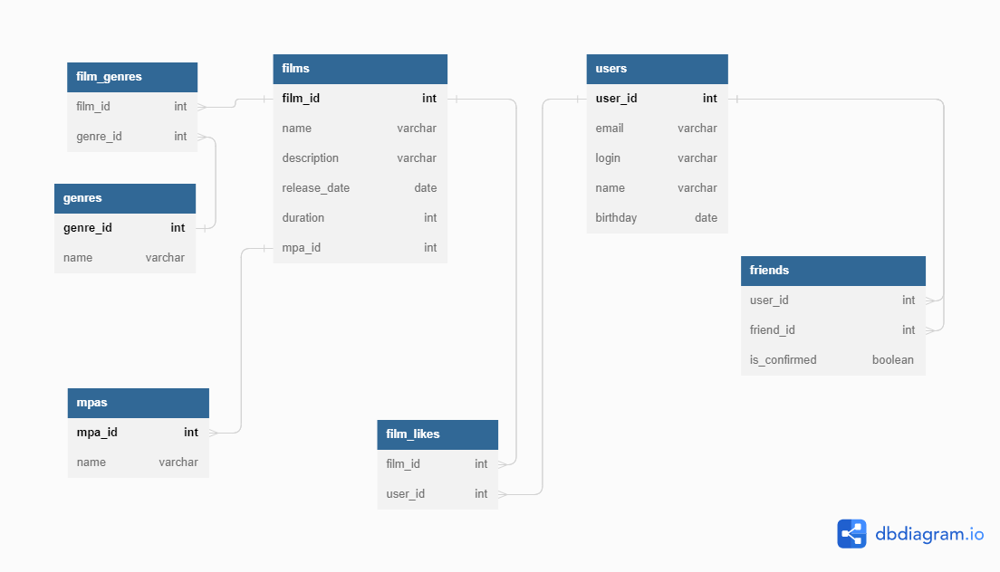

# java-filmorate

<b>Бэкенд для сервиса, который будет работать с фильмами и оценками пользователей, а также возвращать топ-5 фильмов, 
рекомендованных к просмотру. </b>
### Модель базы данных представлена на ER-диаграмме

---

