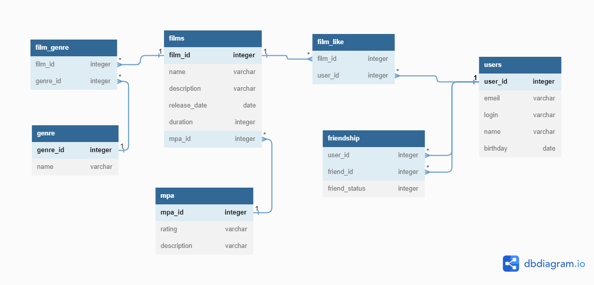

# java-filmorate
Template repository for Filmorate project.


## Пояснение к схеме

### films
Содержание информации о фильмах.
#### Таблица состоит из полей:
+ первичный ключ ```film_id``` - идентификатор фильма;
+ ```name``` - название фильма;
+ ```description``` - описание фильма;
+ ```relese_date``` - год выхода;
+ ```duration``` - продолжительность фильма в минутах;
+ внешний ключ ```mpa_id``` - идентификатор рейтинга;

### mpa
Содержит информацию о рейтинге Ассоциации кинокомпаний (MPA)
#### В таблицу входят поля:
+ первичный ключ ```mpa_id``` - идентификатор рейтинга;
+ ```rating``` - возрастной рейтинг, например:
    - PG - детям рекомендуется смотреть такой фильм с родителями;
    - PG-13 - детям до 13 лет смотреть такой фильм нежелательно.

### film_genre
Содержит информатцию идентификаторов жанра и фильма, образуют составной ключ между таблицами films и genre
#### В таблицу входят поля:
+ первичный ключ ```genre_id``` - идентификатор жанра;
+ внешний ключ ```film_id``` - идентификатор фильма.

### genres
Содержит информацию о жанрах кино.
#### В таблицу входят поля:
+ первичный ключ ```genre_id``` - идентификатор жанра;
+ ```name``` - название жанра.

### film_like
Содержит информацию о лайках к фильмам которые поставили пользователи.
#### В таблицу входят поля:
+ первичный ключ ```film_id``` - идентификатор фильма;
+ внешний ключ ```user_id``` - идентификатор пользователя.

### friendship
Содержит информацию о статусе заявок в друзья.
#### В таблицу входят поля:
+ первичный ключ ```user_id``` - идентификатор пользователя;
+ вторичный ключ ```friend_id``` - идентификатор пользователя для дружбы;
+ ```friends_status``` - статус дружбы.

### users
Содержит данные о пользователях.
#### Таблица включает поля:
+ первичный ключ ```user_id``` - идентификатор пользователя;
+ ```email``` - электронная почта;
+ ```login``` - имя авторизации пользователя;
+ ```first_name``` - имя пользователя;
+ ```birthday``` - дата рождения пользователя.


##Примеры запросов приложения:
+ Добавить поле genre к таблице movie и вывести информацию о фильмах.
```
SELECT *
FROM films AS f
INNER JOIN genre AS g ON g.genre_id=fG.genre_id;
INNER JOIN film_genre AS fG ON f.film_id=fG.film_id;
```

+ Получить топ 20 фильмов по количеству лайков.
```
SELECT f.name, 
       COUNT(fL.user_id) AS count_likes
FROM films AS f
RIGHT JOIN film_like AS fL ON fL.film_id=f.film_id
GROUP BY f.name
ORDER BY count_likes DESC
LIMIT 20; 
```

+ Получить топ 10 пользователей с максимальным количеством друзей
```
SELECT u.first_name, 
       COUNT(f.friend_id) AS count_friends
FROM users AS u
INNER JOIN friendship AS f ON u.user_id=f.user_id
WHERE friends_status = 'CONFIRMED'
GROUP BY u.first_name
ORDER BY count_friends DESC
LIMIT 10; 
```
